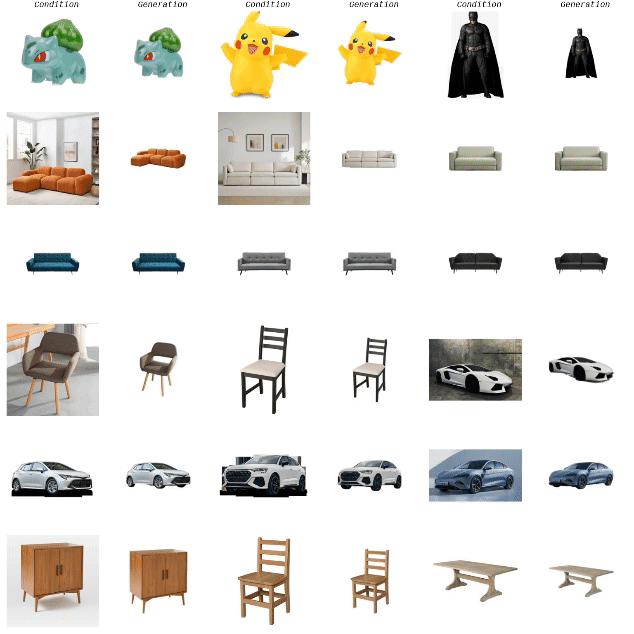
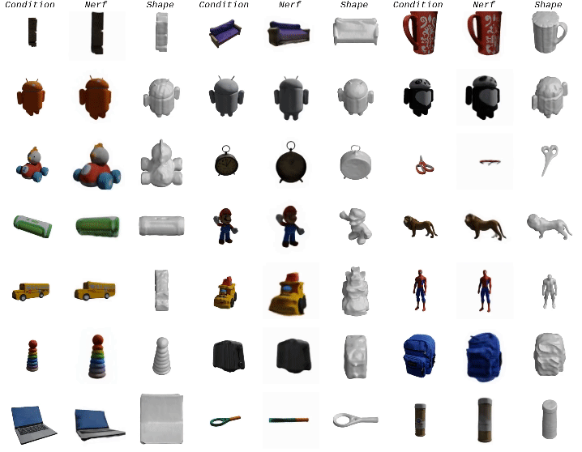

# ViewFusion: Towards Multi-View Consistency via Interpolated Denoising
### [Project Page](https://wi-sc.github.io/ViewFusion.github.io/)  | [Paper](https://openaccess.thecvf.com/content/CVPR2024/html/Yang_ViewFusion_Towards_Multi-View_Consistency_via_Interpolated_Denoising_CVPR_2024_paper.html) | [Arxiv](https://arxiv.org/abs/2402.18842) | [Video]()

[ViewFusion: Towards Multi-View Consistency via Interpolated Denoising](https://wi-sc.github.io/ViewFusion.github.io/)  
 [Xianghui Yang](https://wi-sc.github.io/xianghui-yang)<sup>1,2</sup>, [Yan Zuo](https://www.amazon.science/author/yan-zuo)<sup>1</sup>, [Sameera Ramasinghe](https://www.amazon.science/author/sameera-ramasinghe)<sup>1</sup>, [Loris Bazzani](https://lorisbaz.github.io/)<sup>1</sup>, [Gil Avraham](https://www.amazon.science/author/gil-avraham/)<sup>1</sup>, [Anton van den Hengel](https://researchers.adelaide.edu.au/profile/anton.vandenhengel)<sup>1,3</sup> <br>
 <sup>1</sup>Amazon, <sup>2</sup>The University of Sydney, <sup>3</sup>The University of Adelaide

### [Novel View Synthesis](https://github.com/Wi-sc/ViewFusion#novel-view-synthesis-1):
<p align="center">
  
</p>

### [3D Reconstruction](https://github.com/Wi-sc/ViewFusion#3d-reconstruction-neus):
<p align="center">
  
</p>


## Updates
- [ ] Doing the code clean...
- [x] The project page is online now 🤗: https://wi-sc.github.io/ViewFusion.github.io/.  
- [x] We've limited the autoregressive window size, so don't worry about the memory requirement. It needs around 23GB VRAM so it's totally runnable on a RTX 3090/4090(Ti)!  

##  Usage

### Training

Training? No! We don't need any training or finetuning. :wink:

###  Novel View Synthesis
We use the totally same environment with [Zero-1-to-3](https://github.com/cvlab-columbia/zero123).
```
conda create -n zero123 python=3.9
conda activate zero123
cd zero123
pip install -r requirements.txt
git clone https://github.com/CompVis/taming-transformers.git
pip install -e taming-transformers/
git clone https://github.com/openai/CLIP.git
pip install -e CLIP/
```

Download checkpoint under `zero123` through one of the following sources:

```
https://huggingface.co/cvlab/zero123-weights/tree/main
wget https://cv.cs.columbia.edu/zero123/assets/$iteration.ckpt    # iteration = [105000, 165000, 230000, 300000]
wget https://zero123.cs.columbia.edu/assets/zero123-xl.ckpt
```
[Zero-1-to-3](https://github.com/cvlab-columbia/zero123) has released 5 model weights: `105000.ckpt`, `165000.ckpt`, `230000.ckpt`, `300000.ckpt`, and `zero123-xl.ckpt`. By default, we use `zero123-xl.ckpt`, but we also find that 105000.ckpt which is the checkpoint after finetuning 105000 iterations on objaverse has better generalization ablitty. So if you are trying to generate novel-view images and find one model fails, you can try another one.

We have provided some processed real images in `./3drec/data/real_images/`. You can directly run `generate_360_view_autoregressive.py` and play it. Don't forget to change the model path and configure path in the code.
```
cd ./3drec/data/
python generate_360_view_autoregressive_real.py # generate 360-degree images for real image demo
python generate_360_view_autoregressive.py # generate 360-degree images for multi-view consistency evaluation
python generate_zero123renderings_autoregressive.py # generate only 1 novel-view image given target pose for image quality evaluation
```

If you want to try it on your own images, you may need to pre-process them, including resize and segmentation. 
```
cd ./3drec/data/
python process_real_images.py
```
If you find any other interesting images that can be shown here, please send it to me and I'm very happy to make our project more attractive! :wink:


### Dataset

[Zero-1-to-3](https://github.com/cvlab-columbia/zero123) was trained on objaverse and you can download their renderings with:
```
wget https://tri-ml-public.s3.amazonaws.com/datasets/views_release.tar.gz
```
The GSO renderings evaluated in our paper can be downloaded with:
```
gdown https://drive.google.com/file/d/10JpfE5jqJRiuhQbxn74ks8RsLp1wpMim/view?usp=sharing
```

### 3D Reconstruction (NeuS)
Note that we haven't use the distillation way to get the 3D model, no matter [SDS](https://github.com/ashawkey/stable-dreamfusion) or [SJC](https://github.com/pals-ttic/sjc). We directly train [NeuS](https://github.com/Totoro97/NeuS) as our model can generate consistent multi-view images. Feel free to explore and play around!
```
cd 3drec
pip install -r requirements.txt
cd ../syncdreamer_3drec
python my_train_renderer_spin36.py \
        -i {img_dir}/{model_name}/{inference_id} \
        -n {model_name} \
        -e {elevation} \
        -d {distance} \
        -l {output_dir}
```
- You can see results under: `syncdreamer_3drec/{output_dir}/{model_name}`.  If you are trying on real images and have no idea about the `evaluation` and `distance`, maybe you can set them as default `60/180*pi` and `1.5`, respectively.


##  Acknowledgement
This repository is based on [Stable Diffusion](https://github.com/CompVis/stable-diffusion), [Zero-1-to-3](https://zero123.cs.columbia.edu/), [Objaverse](https://objaverse.allenai.org/), [NeuS](https://github.com/Totoro97/NeuS) and [SyncDreamer](https://github.com/pals-ttic/sjc/). We would like to thank the authors of these work for publicly releasing their code.


##  Citation
```
@misc{yang2024viewfusion,
      title={ViewFusion: Towards Multi-View Consistency via Interpolated Denoising},
      author={Xianghui Yang and Yan Zuo and Sameera Ramasinghe and Loris Bazzani and Gil Avraham and Anton van den Hengel},
      year={2024},
      eprint={2402.18842},
      archivePrefix={arXiv},
      primaryClass={cs.CV}
}
```
